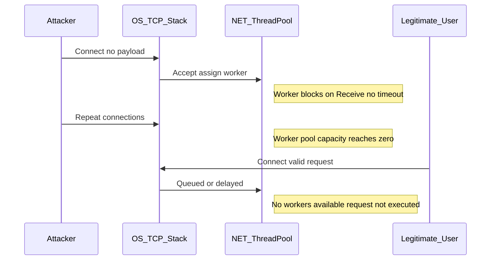

# Phase 03 — Blocking, Waiting, ThreadPool Starvation (Thread Pinning)
**Parent Repository:** [⬅️ Back to Main 16-Phase Series](../README.md)
---

> **TL;DR:** A low-bandwidth, application-layer DoS. By exploiting unbounded blocking I/O (`Receive()`), an attacker can exhaust a .NET ThreadPool and halt request processing without high traffic volume.
---
## Overview

**Category:** Resource Exhaustion  
Pattern: Blocking I/O → ThreadPool Starvation  

This phase demonstrates how blocking socket operations can exhaust server execution capacity without high traffic.

> A connection is assumed to eventually send data.

This assumption allows an attacker to hold worker threads indefinitely, leading to **ThreadPool starvation** and stalled request processing.

---
## Environment Note

On high-resource systems, visible failure may be delayed.  
The vulnerability still exists. Under constrained ThreadPool limits or production load, this pattern leads to **queued work, stalled processing, and request timeouts**.

---

## Running the Project


### Option A: .NET CLI 
Open two separate terminals.

**Terminal 1 (Target Server):**
```bash
cd BlockingThreadPinning
dotnet run
```
**Terminal 2 (Attacker Client):**
```bash
cd ClientSender
dotnet run
```

## Using .NET Framework GUI
Set multiple startup projects in Visual Studio:

1. Right click solution → Set Startup Projects  
2. Choose "Multiple startup projects"  
3. Set both ServerListener and ClientSender to "Start"  
4. Press F5  

This runs both the vulnerable server and exploit client simultaneously.

---

## Core Concepts

### Blocking
`Receive()` is a blocking call.  
If the client sends no data, the worker thread waits indefinitely.

### Thread Pinning
A worker thread becomes **pinned** when it is blocked on I/O with no timeout and cannot return to the ThreadPool.

### Waiting (Queue Backlog)
When all workers are occupied, new work is **queued but not executed** → perceived service freeze.

---

## Core Vulnerability — Unbounded Blocking on Worker Threads

The server assigns a ThreadPool worker and performs a blocking `Receive()` with no timeout.  

An attacker can open connections and send no data, causing workers to block indefinitely →  
**ThreadPool starvation → request processing halts (DoS)**.

---

## Protocol / Execution Flow
```
TCP Connect -> Accept -> Queue to ThreadPool -> Receive blocking
-> no data -> worker not released -> pool capacity decreases

```



---

## Attacker Model

1. Establish TCP connections  
2. Send **no payload**  
3. Keep connections open  

**Result:** Each connection consumes one worker indefinitely.

---

## Observable Signals (Correct Metrics)

- Available worker threads ↓ toward 0  
- Active connections ↑  
- Requests connect but **do not get processed**  

> ThreadPool starvation is visible via **available worker depletion**, not OS thread count.

---

## Core Insight

> The server delegates execution control to the client by blocking on `Receive()` without timeout.

- Sudden drop in available worker threads without corresponding throughput increase 
This is **scheduler-level exhaustion via protocol stalling**.

---

## ⚠️ Important Clarification

### ❌ This is NOT:
- A network-layer DoS  
- A SYN flood  
- A high-volume volumetric attack  

### ✅ This IS:
- An application-layer DoS  
- ThreadPool worker starvation  
- An asymmetric resource exhaustion attack   

---

## Code Insight (Precise)

- `ThreadPool.QueueUserWorkItem` → bounded worker pool; blocking tasks can exhaust it  
- `ThreadPool.SetMaxThreads(x, y)` → caps worker capacity → makes starvation observable  
- `ThreadPool.GetAvailableThreads(out worker, out io)` → shows remaining execution capacity  
- `Interlocked.Increment(ref activeConnections)` → thread-safe tracking of live connections  

---

## Execution Insight (Client Behavior)

- Connections succeed  
- Requests appear “sent”  
- No response is returned  
- System appears alive but **non-functional**  

---

## Failure Signals

- Connections accepted but not processed  
- Increasing latency → eventual timeouts  
- Connection refusals when backlog/processing limits are reached  

---

## Success Condition

> When **available worker threads = 0**, new tasks cannot execute → starvation achieved.

---

## Critical Observation

> Async I/O removes thread blocking, but does not eliminate resource exhaustion if connection limits and timeouts are not enforced.

---

## Found in the Wild

This is not a theoretical issue. Similar patterns are observed in real systems:

- **Custom TCP services** — internal tools or gateways that rely on blocking socket reads  
- **Legacy game servers** — synchronous connection handling with bounded worker models  
- **Internal microservices** — services using blocking I/O without timeout or lifecycle control  

These systems often assume that connected clients will eventually send data, making them susceptible to **ThreadPool starvation under idle or malicious connections**.

---
## CWE Mapping

- CWE-400: Uncontrolled Resource Consumption  
- CWE-664: Improper Control of a Resource Through its Lifetime  

---

## OWASP Mapping

- OWASP A05:2021 – Security Misconfiguration  

---

## Defensive Controls

- Enforce receive timeout (bounded wait)  
- Avoid blocking I/O on worker threads → use async patterns  
- Apply connection limits + idle connection eviction  

### Monitor:
- Worker thread availability  
- Connection-to-throughput ratio  

---

## Detection

- Alert when available worker threads < 20% of pool size  
- High socket-to-throughput ratio (many open sockets, low data flow)  
- Threshold: socket open > 15s with 0 bytes received = pin attempt  

---

## Alternate Model — Thread-per-Connection (Comparison Only)

For comparison, the same pattern behaves differently under a thread-per-connection model.

### Behavior

- Each connection → dedicated OS thread  
- Blocking `Receive()` → thread never released  
- No upper bound → threads grow unbounded  

### Impact

- High memory usage  
- Context switching overhead  
- Eventual system slowdown or crash  

---

## 🛡️ Fix — Async + Timeout + Connection Control

```csharp
// Accept async (no blocking)
var client = await server.AcceptAsync();

// Enforce connection limit
if (activeConnections >= MAX_CONNECTIONS)
{
    client.Close();
    return;
}

Interlocked.Increment(ref activeConnections);
_ = HandleClientAsync(client);

static async Task HandleClientAsync(Socket client)
{
    try
    {
        var buf = new byte[1024];

        using var cts = new CancellationTokenSource(TimeSpan.FromSeconds(10));

        int n = await client.ReceiveAsync(buf, SocketFlags.None, cts.Token);

        if (n > 0)
            await client.SendAsync(Encoding.UTF8.GetBytes("Hello"), SocketFlags.None);
    }
    catch (OperationCanceledException)
    {
        Console.WriteLine("[TIMEOUT] Dropping idle client");
    }
    finally
    {
        client.Close();
        Interlocked.Decrement(ref activeConnections);
    }
}
```
