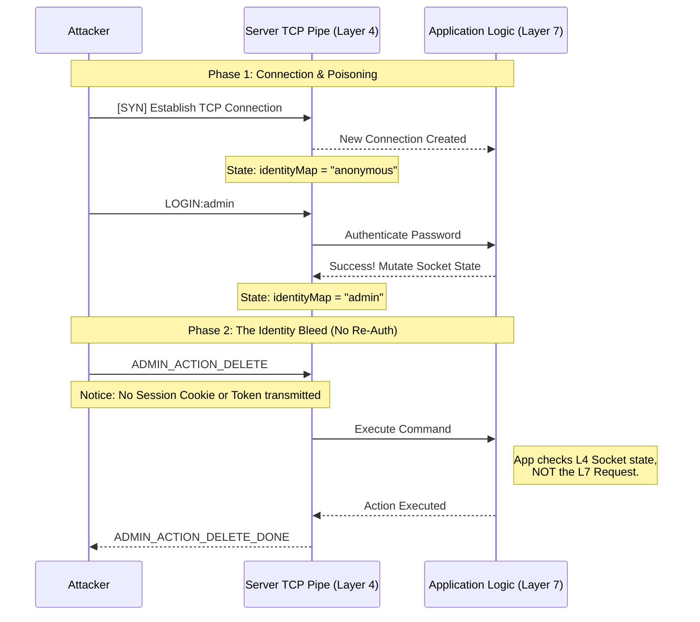

# Phase 07 — Connection Reuse & Identity Bleed

**Parent Repository:** [⬅️ Back to Phase-05-Stream-Desynchronization](../README.md)

**TL;DR:** A stateful authentication flaw. When identity is bound to a persistent connection instead of each request, an attacker can reuse a single authenticated session to perform privileged actions indefinitely without re-authentication.

---

## Overview

**Category:** Authentication / Session Management Flaw  
**Pattern:** Connection-bound Identity → Privilege Persistence  

This phase demonstrates how persistent socket connections combined with connection-level identity storage allow attackers to reuse elevated privileges.

The server assumes:

A connection represents a trusted authenticated user

This assumption allows:

One-time authentication → unlimited privileged actions

---

## Environment Note

On simple lab setups, the issue appears stable and obvious.

In real systems:
- Timeouts
- Proxies
- Connection reuse pools

may influence behavior — but the core flaw remains exploitable under sustained connections.

---

## Running the Project

### Phase-07-POC

### Option A: .NET CLI

Open two terminals.

**Terminal 1 (Server):**
```bash
cd Phase07_ConnectionReuse
dotnet run

Terminal 2 (Attacker):
cd Attacker
dotnet run

```
________________________________________
Using Visual Studio
•	Right click solution → Set Startup Projects 
•	Select Multiple startup projects 
•	Start both Server and Attacker 
•	Press F5 
________________________________________

## Core Concepts
Connection Reuse
A single TCP connection is reused for multiple requests without re-authentication.
Connection-Bound Identity
Identity is stored as:
ConcurrentDictionary<Socket, string>
This binds user identity to the socket, not the request.
Privilege Persistence
Once authenticated:
All future messages inherit that identity
________________________________________

## Core Vulnerability — Identity Bound to Connection
The server stores identity at connection level:
Socket → User
Instead of validating each request.
Result
LOGIN:admin
→ connection becomes admin

ADMIN_ACTION
ADMIN_ACTION
ADMIN_ACTION
→ all succeed without re-auth
________________________________________
## Protocol / Execution Flow
TCP Connect
→ Accept
→ identity = anonymous
→ LOGIN:admin
→ identity updated (connection-level)
→ subsequent requests reuse identity
→ no re-validation
________________________________________
## Attacker Model
•	Establish single TCP connection 
•	Authenticate once (LOGIN:admin) 
•	Send repeated privileged actions 
•	Keep connection alive 
________________________________________
## Observable Signals (Correct Metrics)
•	Repeated privileged actions without login events 
•	Long-lived connections with elevated roles 
•	High action count per connection 
________________________________________
Core Insight
The server trusts the connection, not the request.
Control shifts from server → attacker-controlled connection lifecycle.
________________________________________

## ⚠️ Important Clarification
### ❌ This is NOT:
•	Broken password validation 
•	Brute force attack 
•	Token theft 
✅ This IS:
•	Session misbinding 
•	Connection-level trust flaw 
•	Authorization bypass via reuse 
________________________________________

## Code Insight (Precise)
identityMap[client] = "anonymous";
string currentUser = identityMap[client];
Identity is retrieved from connection state, not request data.
identityMap[client] = user;
Authentication persists for entire connection lifetime.
if (msg == "ADMIN_ACTION" && currentUser == "admin")
Authorization depends on stale connection state.
________________________________________

## Execution Insight (Client Behavior)
•	LOGIN succeeds once 
•	Subsequent ADMIN_ACTION calls succeed 
•	No re-authentication required 
________________________________________

### Architectural Attack Flow


________________________________________

## Failure Signals
•	Privileged actions without recent login 
•	Long-lived admin sessions 
•	No session expiry enforcement 
________________________________________

## Success Condition
Attacker performs multiple admin actions after a single login.
________________________________________

## Critical Observation
Timeouts do NOT fix this vulnerability.
Idle timeout can be bypassed via periodic activity (keep-alive).
________________________________________

## Found in the Wild
•	Custom TCP services (internal tools) 
•	Legacy game servers 
•	Backend services using connection pooling 
•	Reverse proxy → backend identity reuse issues 
________________________________________

## CWE Mapping
•	CWE-287: Improper Authentication 
•	CWE-613: Insufficient Session Expiration 
•	CWE-522: Insufficiently Protected Credentials 
________________________________________

## OWASP Mapping
•	OWASP A07:2021 – Identification and Authentication Failures 
________________________________________

## Defensive Controls
•	Enforce per-request authentication (token-based) 
•	Do NOT bind identity to socket 
•	Implement session expiry (absolute + idle) 
•	Revalidate privileges on every sensitive action 
________________________________________

## Detection
•	ADMIN_ACTION without LOGIN in last N seconds 
•	High privilege actions per connection 
•	Long-lived authenticated sockets 
Threshold Example
> 50 privileged actions per connection within 60 seconds without re-auth
________________________________________

## 🛡️ Fix — Per-Request Authentication
if (msg.StartsWith("ADMIN_ACTION:token="))
{
    var token = ExtractToken(msg);
    var claims = Validate(token);

    if (claims?.Role != "admin")
    {
        client.Send("DENIED");
        continue;
    }
}
________________________________________

### Alternate Model — Stateless Authentication
Each request carries its own authentication proof.
No reliance on connection state → No identity bleed.
________________________________________

## Final Insight
Connection persistence + identity caching = privilege persistence
________________________________________
## One-Line Summary
If identity lives in the connection, whoever controls the connection controls the privilege.

---

If you want, I can next:
- Add **diagram (attack flow)**  
- Add **GIF demo idea for GitHub**  
- Or align all phases into a **consistent repo branding style**

# POC


